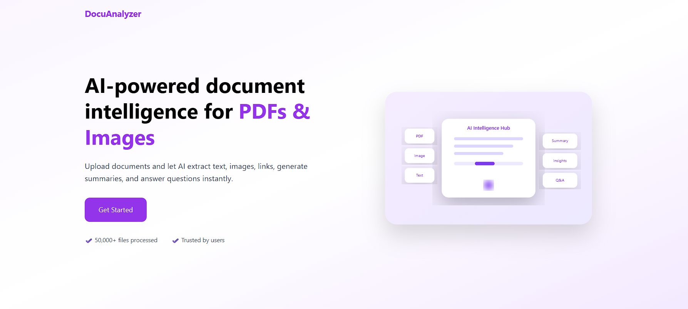
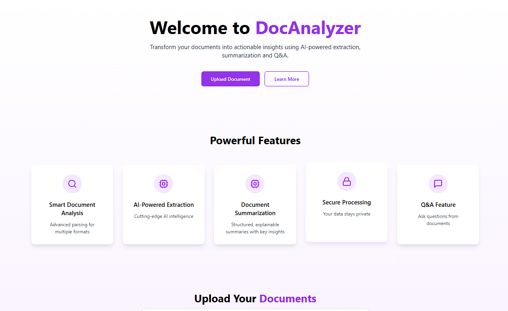

### 📄 DocAnalyzer – AI-Powered Document Intelligence System

DocAnalyzer is a full-stack AI application that transforms unstructured documents (PDFs & images) into actionable insights using Retrieval-Augmented Generation (RAG).
It enables users to extract text, images, links, ask questions, and generate human-like summaries and answers from uploaded documents.

### 🚀 Features

✅ Core Capabilities
📄 Document Upload (PDF, PNG, JPG, JPEG, TIFF)
📝 Text Extraction
🖼️ Image Extraction
🔗 Link Extraction
❓ Question Answering (RAG-based)
📚 Context-aware, explanatory answers
⚡ Fast semantic search using FAISS
🔐 Secure and private processing
🧠 AI Intelligence
Sentence-level semantic embeddings
FAISS vector database for retrieval
LLM-powered answers using FLAN-T5
Hallucination-safe, document-grounded responses

### 🏗️ Architecture Overview
PDF / Image Upload
        ↓
Text Extraction
        ↓
Chunking (Overlapping)
        ↓
Embeddings (SentenceTransformer)
        ↓
Vector DB (FAISS)
        ↓
Retriever
        ↓
Prompt Construction
        ↓
LLM (FLAN-T5)
        ↓
Final Answer / Summary

### 🖥️ Tech Stack
## Frontend

⚛️ React + TypeScript
🎨 Tailwind CSS
🎞️ Framer Motion
🧩 Lucide Icons
🔄 Axios

## Backend

🚀 FastAPI
📚 FAISS
🤗 Transformers
🔤 SentenceTransformers
🧠 FLAN-T5 (LLM)
🖼️ PDF & Image Processing

### 📂 Project Structure
DocAnalyzer/
│
├── frontend/
│   ├── src/
│   │   ├── App.tsx
│   │   ├── Landing.tsx
│   │   ├── components/
│   │   └── ...
│
├── backend/
│   ├── main.py
│   ├── question_ans.py
│   ├── text_extraction.py
│   ├── image_extraction.py
│   ├── links.py
│   ├── upload/
│   │   └── upload_file.py
│   └── uploaded_pdfs/
│
├── README.md
└── requirements.txt

### ⚙️ Setup Instructions
1️⃣ Backend Setup
cd backend
python -m venv venv
source venv/bin/activate  # Windows: venv\Scripts\activate
pip install -r requirements.txt

Run the backend:
uvicorn main:app --reload

Backend runs at:
http://127.0.0.1:8000

2️⃣ Frontend Setup
cd frontend
npm install
npm run dev

Frontend runs at:
http://localhost:5173

### 🔗 API Endpoints

Method	Endpoint	Description
POST	/upload/	Upload document
GET	/extract-text/	Extract text
GET	/extract-images/	Extract images
GET	/extract-links/	Extract links
POST	/ask-question/	Ask questions (RAG)
🧠 RAG Implementation (Key Highlight)

The Question Answering system uses Retrieval-Augmented Generation:

Chunks document into semantic units
Embeds chunks using all-MiniLM-L6-v2
Stores vectors in FAISS
Retrieves only highly relevant content
Uses FLAN-T5 to generate human-like answers
Prevents hallucinations using relevance thresholds

🧪 Example Questions

What are variables in Python?
What is the purpose of this document?
Explain the responsibilities mentioned in the PDF.
Summarize the key points of this document.
What technologies are discussed?

🌟 UI Highlights

✨ Glassmorphism cards
🎯 Auto-scroll after upload
✅ Upload success feedback
📱 Responsive layout
🧠 Intuitive action flow
🎨 Gradient-based modern design

### 🔮 Future Enhancements

📄 Document Summarization (structured)
📥 Download answers as PDF
🧠 Persistent vector DB per document
📊 Answer confidence score
🔍 Highlight answer source text

Soumya Kanta Sahoo
🔗 LinkedIn: https://www.linkedin.com/in/soumya-kanta-sahoo/
📧 Email: soumyakantasahoo08@gmail.com